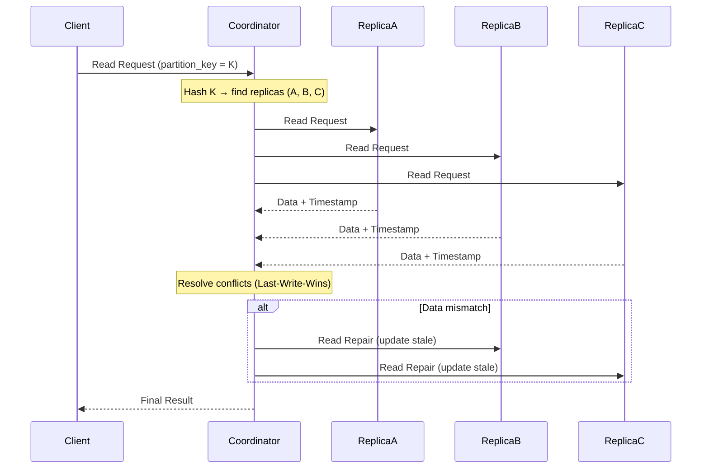
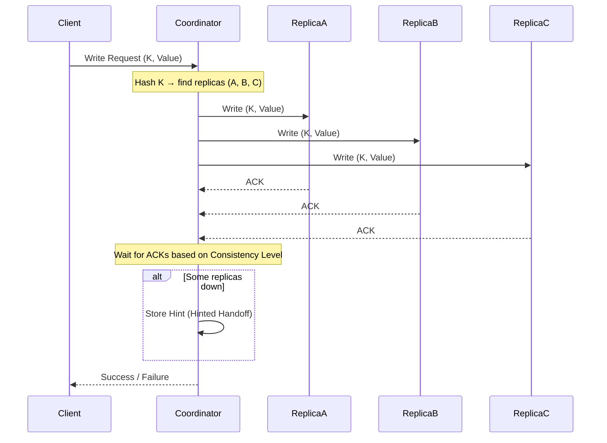

# Cassandra Architecture

## READ Operation (Partition Key Read)

```mermaid
sequenceDiagram
    participant Client
    participant Coordinator
    participant ReplicaA
    participant ReplicaB
    participant ReplicaC

    Client->>Coordinator: Read Request (partition_key = K)

    Note over Coordinator: Hash K → find replicas (A, B, C)

    Coordinator->>ReplicaA: Read Request
    Coordinator->>ReplicaB: Read Request
    Coordinator->>ReplicaC: Read Request

    ReplicaA-->>Coordinator: Data + Timestamp
    ReplicaB-->>Coordinator: Data + Timestamp
    ReplicaC-->>Coordinator: Data + Timestamp

    Note over Coordinator: Resolve conflicts (Last-Write-Wins)

    alt Data mismatch
        Coordinator->>ReplicaB: Read Repair (update stale)
        Coordinator->>ReplicaC: Read Repair (update stale)
    end

    Coordinator-->>Client: Final Result
```
---

## WRITE Operation 

```mermaid
sequenceDiagram
    participant Client
    participant Coordinator
    participant ReplicaA
    participant ReplicaB
    participant ReplicaC

    Client->>Coordinator: Write Request (K, Value)

    Note over Coordinator: Hash K → find replicas (A, B, C)

    Coordinator->>ReplicaA: Write (K, Value)
    Coordinator->>ReplicaB: Write (K, Value)
    Coordinator->>ReplicaC: Write (K, Value)

    ReplicaA-->>Coordinator: ACK
    ReplicaB-->>Coordinator: ACK
    ReplicaC-->>Coordinator: ACK

    Note over Coordinator: Wait for ACKs based on Consistency Level

    alt Some replicas down
        Coordinator->>Coordinator: Store Hint (Hinted Handoff)
    end

    Coordinator-->>Client: Success / Failure
```