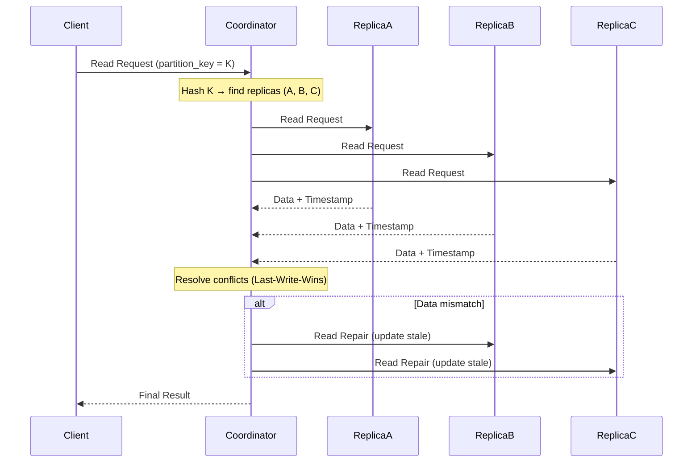
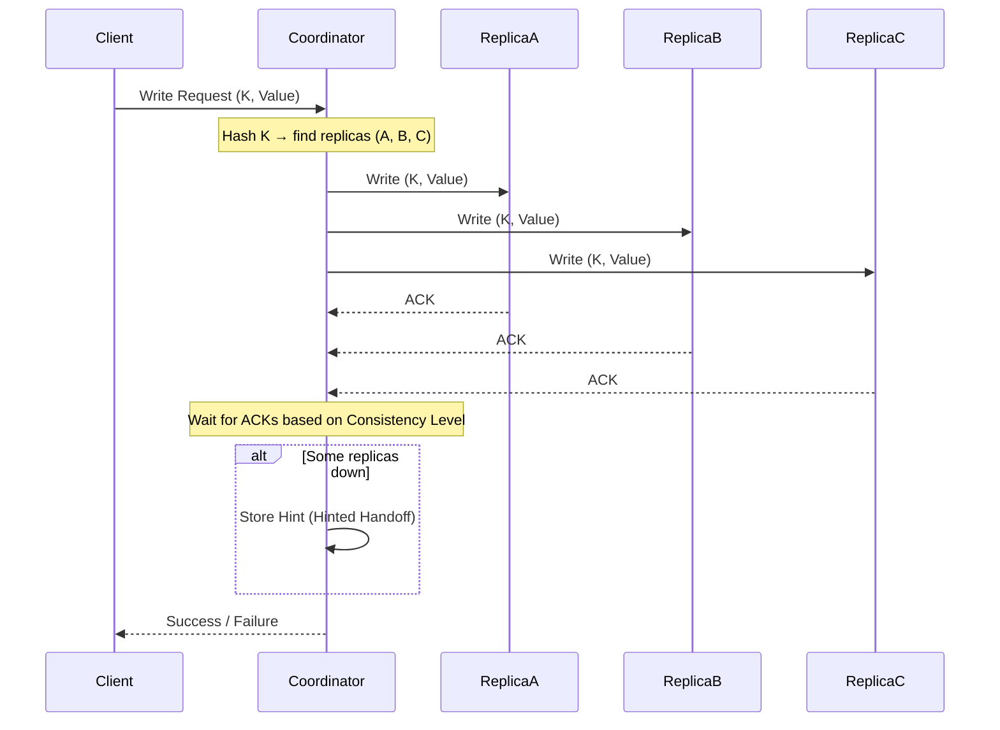
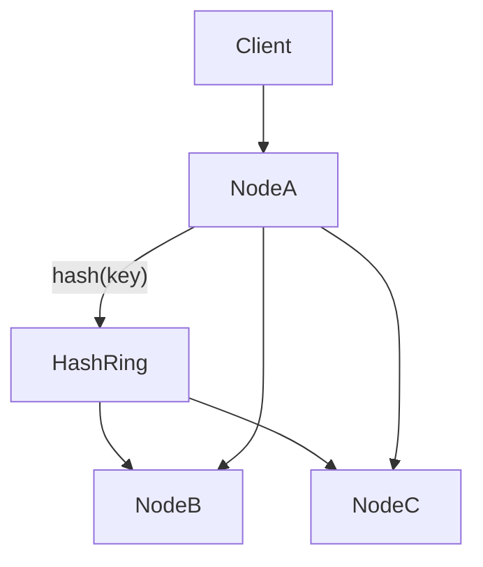
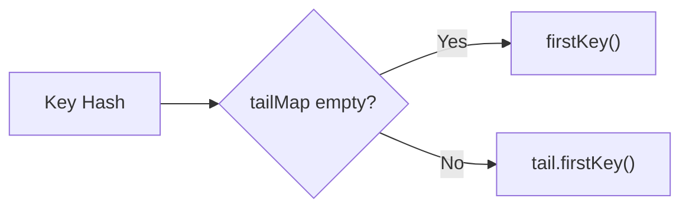
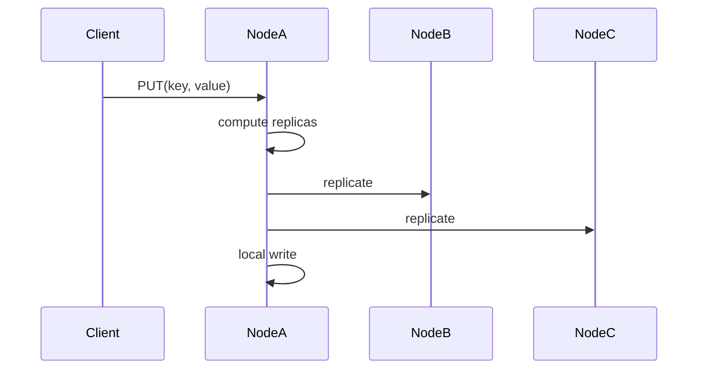

# Regular Cassandra Architecture

## READ Operation (Partition Key Read)


---

## WRITE Operation 

---

# Hashandra (Mini Cassandra Clone)

## Overview
Hashandra is a simplified distributed key-value store inspired by Cassandra.

### Features
- Consistent Hashing (TreeMap-based)
- Replication (RF = 3)
- Coordinator-based writes
- Feign-based inter-node communication
- In-memory storage (ConcurrentHashMap)

---

## Architecture
The node which receives the request from the Client acts as the Coordinator node.       
(Here it's **Node A**)



---

## Hash Ring Logic



---

## Write Flow



---

## Core Code Snippets

### Get Primary Node

```java
int nodeHash = tail.isEmpty() ? ring.firstKey() : tail.firstKey();
```

### Replication Loop

```java
for (Node node : replicas) {
    if (node.getId().equals(selfId)) {
        store.put(key, value);
    } else {
        feignClientMap.get(node.getId()).replicate(req);
    }
}
```

---

## Running Multiple Nodes

### Node A
```bash
SERVER_PORT=8081 NODE_NAME1=nodeA NODE_NAME2=nodeB NODE_NAME3=nodeC NODE_URL1=http://localhost:8081 NODE_URL2=http://localhost:8082 NODE_URL3=http://localhost:8083 java -jar build/libs/hashandra.jar
```

### Node B
```bash
SERVER_PORT=8082 NODE_NAME1=nodeB NODE_NAME2=nodeA NODE_NAME3=nodeC NODE_URL1=http://localhost:8082 NODE_URL2=http://localhost:8081 NODE_URL3=http://localhost:8083 java -jar build/libs/hashandra.jar
```

### Node C
```bash
SERVER_PORT=8083 NODE_NAME1=nodeC NODE_NAME2=nodeA NODE_NAME3=nodeB NODE_URL1=http://localhost:8083 NODE_URL2=http://localhost:8081 NODE_URL3=http://localhost:8082 java -jar build/libs/hashandra.jar
```

---

## Testing

```bash
curl -X POST http://localhost:8081/put \
     -H "Content-Type: application/json" \
     -d '{"key":"user1","value":"Sumanth"}'
```

---

## Key Learnings

- Consistent hashing distributes keys deterministically
- Coordinator node handles routing
- Replication ensures redundancy
- Each node maintains identical hash ring

---

## Future Improvements

- Quorum reads/writes
- Node failure handling
- Gossip protocol
- Virtual nodes